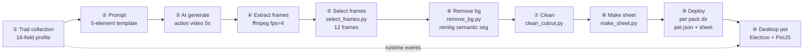

# PetPet Playbook · How to Build a Desktop Pet from Your Real Pet


> Not "yet another desktop pet app" — it's a **complete methodology for turning your real pet into a living desktop companion**: AI-generated likeness, its own actions, its own personality, sitting on your desktop while you work.

This repository is a **full playbook**: pet trait collection → AI asset generation → sprite-sheet pipeline → desktop pet implementation, with real decisions, real data, and real pitfalls recorded along the way.

> ⚠️ **Set expectations first**: this is NOT a one-click "upload photo → get pet" tool. AI generation is a dice roll (same prompt can yield different results), and owner verification is irreplaceable (AI can misidentify your pet's features). The full flow requires hands-on work: fill the trait form, write prompts, generate, pick frames. **Semi-automated buys you control** — you decide what it looks like and what it does. If you just want a photo to "come alive", Doubao's "Photo Alive" feature is enough; you don't need this.

> 📦 **What's inside**: methodology (`docs/`) + pipeline scripts (`pipeline/`) + **a runnable client reference implementation** (`viewer/`, Electron + PixiJS — load your own pet pack and it runs; tested on macOS).

---

## Who is this for

- **Pet owners**: want a "living" desktop twin of your own cat/dog — free & open source, **no programming needed**, but requires patience to walk the full pipeline (AI generation is not one-click; owner verification is irreplaceable)
- **Developers**: want to learn/reuse a complete "real pet → runnable desktop pet" production pipeline (Python pipeline + Electron/PixiJS client reference implementation)
- **Pet product folks**: researching "pet digital twin" product patterns, real data, and pitfalls

**Not for**: just making a photo move (Doubao "Photo Alive" is enough); wanting ready-made pet asset libraries (VPet/Creative Workshop fits better). **This repo is not a one-click "upload photo → get pet" tool, and does not ship generic pet assets.**

**📖 English speakers:** the docs are written in Chinese. The methodology is language-agnostic — the **pipeline scripts, JSON schemas, and viewer code are universal**. Start with the sections below; `docs/01` (data model), `docs/05` (pipeline), `docs/08` (contract) are the most valuable even without Chinese. Machine translation works well on these files.

---

## Quick Start (run the asset pipeline)

```bash
# 1. Install dependencies (numpy/Pillow/rembg/scipy, see requirements.txt)
pip install -r requirements.txt

# 2. Run in order (12 frames as example)
python pipeline/select_frames.py --input <frames-dir> --output selected/ --frames 12
python pipeline/remove_bg.py     --input selected/ --output cutout/
python pipeline/clean_cutout.py  --input cutout/   --output clean/
python pipeline/make_sheet.py    --input clean/    --output . --name mypet.png

# 3. Configure pet.json per the contract, then validate
python pipeline/validate_pet.py mypet/            # rejects missing fields / texture overflow

# 4. (Optional) generate prompts from a pet profile:
#    python pipeline/validate_pet.py --profile pet-profile.json   # validate + derive ratios
#    python pipeline/gen_prompt.py --profile pet-profile.derived.json --action stretch
```

**Verification** (optional):

```bash
python tests/smoke_test.py   # pipeline smoke test
pytest tests/                # unit tests (21 cases)
```

> 💰 **Budget note**: each action's AI video costs ~45-130 credits (Jimeng platform, 2.0/2.5 models). A full 8-action pet is real money (hundreds of credits) — evaluate before starting.
>
> 🐕 **Sample disclaimer**: the full flow has been verified on **two breeds** — "Redshao" the tricolor border collie (full 8-action loop) and "Baobao" the golden retriever × German shepherd mix (setup-image anchor loop; assets in `examples/baobao/`). Other breeds/species need prompt tuning per `docs/02`; the pipeline scripts themselves are universal.

**Run the client** (`viewer/`, tested on macOS):

```bash
cd viewer
npm install          # Electron + PixiJS (1-2 min on first run)
npm run dev          # dev mode: loads pet packs from ~/.petpet/pets/<name>/
npm run build        # build renderer (dist/)
npm start            # build then launch
```

**See it immediately**: `examples/redshao-demo/` is a **minimal runnable pet pack** (cuddle-bear idle + sleep + stretch, v3 contract with a `sleep→stretch` transition chain, compressed to 512px, ~6MB). Copy it to your user data dir:

```bash
# macOS
mkdir -p ~/.petpet/pets && cp -r examples/redshao-demo ~/.petpet/pets/redshao-demo
# Windows
# copy examples/redshao-demo to C:\Users\<username>\.petpet\pets\redshao-demo
```

---

## What Makes This Different

| Project | stars | Positioning | vs. this repo |
|---------|-------|-------------|---------------|
| VPet | 6588 | General desktop-pet simulator (Steam + Workshop) | consumes ready assets; no photo→pet pipeline |
| Clawd-on-desk | 5863 | AI-coding-assistant status visualization | agent states, not a real pet |
| PPet | 2033 | Live2D model loader | needs ready model assets; no production pipeline |
| HermesPet | 595 | macOS-native AI companion | AI chat positioning, not a pet avatar |
| MiniCPM Desk Pet | 416 | Local-model pet (Clawd fork) | shell + model; assets still manual |
| **this repo** | — | **Full production pipeline from real pet photos to desktop pet** | methodology + scripts + client; works with any shell |

> Mainstream desktop-pet projects *consume* ready assets. This repo sits on the **production side**: start from your pet's real photos and generate its own likeness, actions, and personality. (stars measured via GitHub API, 2026-08; full landscape in `docs/03`.)

---


*Redshao, a border collie turned desktop pet. ▶️ [See the 5-action demo GIF (~1MB)](assets/demo.gif): sleep → cuddle-bear idle → wiggle → run → stretch. Assets made by AI generation + rembg pipeline; full flow in this repo.*

---

## The Full Flow (one picture)



- ①② are **one-time** (trait collection + setup-image verification); ③-⑧ are **per-action** (pipeline scripts in `pipeline/`); ⑨⑩ are **incremental** (adding actions = changing data, not code)
- Every step's tool is replaceable (see `docs/05`)

---

## Repo Structure

```
petpet-playbook/
├── README.md            this file (overview + nav) / README.en.md (English)
├── docs/                methodology docs (00-12 + review checklist, Chinese)
├── pipeline/            runnable scripts (select/remove-bg/clean/make-sheet/validate/prompt)
├── schema/              machine-readable contracts (pet.json v3 + 16-field profile)
├── templates/           fill-in templates
├── viewer/              client reference implementation (Electron + PixiJS source)
├── tests/               pipeline tests (smoke + pytest)
├── examples/            sample assets (redshao-demo: runnable minimal pack; redshao: full 8-action; baobao: second breed)
├── requirements.txt     Python deps (version-bounded)
├── pyproject.toml       ruff config
├── LICENSE              MIT (code) + asset copyright statement
├── SECURITY.md          vuln reporting & security boundary
└── CONTRIBUTING.md      contribution guide
```

---

## Core Ideas (one-liners)

1. **Pet = data pack**: switch pets by switching directories, never touch code
2. **Prompt is a translation of traits**: structured traits → controllable generation
3. **Every tool is replaceable**: Jimeng/rembg/PIL are not the only options
4. **Mischief has boundaries**: visual mischief yes, real file operations no
5. **Honest status labels**: never claim support for something untested

---

## Roadmap

> Direction adjusts with real-user validation results (open source: no pie-in-the-sky, directions only, no timelines promised).

**✅ Done**: asset pipeline (frame extraction / background removal / sprite sheets / validation); viewer reference implementation (8 actions + behavior transition chains + reminder system + diary + themes); 13 methodology docs; CI/Release automation; bilingual README; sample pet packs (redshao full loop / redshao-demo minimal playable)

**🔨 In progress**: real-user validation (Windows install loop, word-of-mouth feedback) — results decide next direction

**🔭 Planned** (adjusts to validation): pet identity & temperament model (behavior tendency modulation); memory & relationship system (events → habits → relationship); showcase & sharing capability

---

## Contributing

- New pet examples: submit your pet pack (per the `docs/08` contract) to `docs/宠物包收录.md` (link only, no asset files)
- New pitfalls: append your incident to `docs/07`
- Docs are in Chinese; English translations of `docs/` are welcome via PR

---

## License

- **Code** (`pipeline/` scripts, `viewer/`): [MIT](LICENSE)
- **Assets** (pet photos, setup images, demo GIF in `examples/`): copyright belongs to the pet owners; example-only, no commercial use or redistribution
- **Animation assets** generated by Jimeng AI; keep the platform AI badge when distributing (see `docs/02`)
