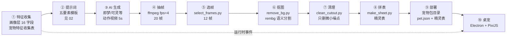

# PetPet Playbook · 桌宠制作方法论

[English](README.en.md) | **中文**


*红苕（一只被做成桌宠的边牧）在桌面上的样子。▶️ [看 5 动作演示动画（GIF ~1MB）](assets/demo.gif)：睡觉 → 抱熊待机 → 撒娇 → 奔跑 → 伸懒腰。素材由 AI 生成 + rembg 管线制作，全流程见本仓库。*

> 不是"又一个桌宠软件"，是**给心爱的宠物做一只活在电脑里的替身**——用 AI 生成它自己的形象、自己的动作、自己的性格，让它在工作时陪着你。

本仓库是一套**完整的方法论**：从宠物特征收集 → AI 素材生成 → 精灵表管线 → 桌宠实现，全程记录真实决策、真实数据、真实踩坑。

> ⚠️ **先对齐预期**：这不是"上传照片 → 自动生成桌宠"的一键工具。AI 生成是抽卡（同提示词可能出不同结果）、主人核实不可替代（AI 会认错宠物特征），所以完整流程需要你亲手走：填特征表、写提示词、生成、选帧。**半自动换来的是可控制**——你决定它长什么样、做什么动作。如果只想要"照片能动起来"，用豆包「照片动起来」就够了，不需要这套。

> 📦 **仓库内容**：方法论（docs/）+ 素材管线脚本（pipeline/）+ **可运行客户端参考实现**（viewer/，Electron + PixiJS，加载你自己的宠物包即可运行，macOS 实测）。

---

## 这是给谁的

- **有宠物的人**：想给自家猫狗做一只"活的"桌面替身——免费开源，**不需要会编程**，但需要耐心走完整管线（AI 生成不是一键，主人核实不可替代）
- **开发者**：想学习/复用"真实宠物 → 可运行桌宠"的完整生产管线（Python 管线 + Electron/PixiJS 客户端参考实现）
- **宠物产品人**：研究"宠物数字替身"方向的产品形态、真实数据与踩坑记录

**不适用于**：只想让照片动起来（豆包「照片动起来」即可）；想要现成宠物素材库（VPet/创意工坊更合适）。**本仓库不做"上传照片 → 自动出桌宠"的一键工具，也不提供通用宠物素材**。

---

## 与其他桌宠项目的区别

| 项目 | star | 定位 | 与本文档的关系 |
|------|------|------|---------------|
| VPet | 6588 | 通用桌宠模拟器（Steam + 创意工坊） | 消费现成素材，无照片→桌宠管线 |
| Clawd-on-desk | 5863 | AI 编程助手状态可视化 | 面向 AI 状态，非真实宠物 |
| PPet | 2033 | Live2D 模型加载器 | 需现成模型资产，无生产管线 |
| HermesPet | 595 | macOS 原生 AI 伴侣 | AI 对话定位，非宠物替身 |
| MiniCPM Desk Pet | 416 | 本地模型桌宠（Clawd 二开） | 壳+模型，素材仍需人工 |
| **本仓库** | — | **从真实宠物照片到桌宠的完整生产管线** | 方法论 + 脚本 + 客户端，可与任何壳配合 |

> 主流桌宠项目都是「消费现成素材」，本文档所在的位置是「**生产端**」：从你家宠物的真实照片出发，生成它自己的形象、动作与性格（star 为 2026-08 GitHub API 实测；完整赛道对比见 [03-需求梳理.md](03-需求梳理.md)）。

---

## 快速开始（跑素材管线）

```bash
# 1. 安装依赖（numpy/Pillow/rembg/scipy，见 requirements.txt）
pip install -r requirements.txt

# 2. 按顺序跑（以 12 帧为例）
python pipeline/select_frames.py --input <抽帧目录> --output selected/ --frames 12
python pipeline/remove_bg.py     --input selected/ --output cutout/
python pipeline/clean_cutout.py  --input cutout/   --output clean/
python pipeline/make_sheet.py    --input clean/    --output . --name mypet.png

# 3. 得到精灵表后，按 08-接口协议 配置 pet.json，用校验器检查
python pipeline/validate_pet.py mypet/            # 校验宠物包（缺字段/纹理超限会报错）

# 4.（可选）从宠物画像生成提示词：
#    python pipeline/validate_pet.py --profile pet-profile.json   # 先校验画像+算派生比例
#    python pipeline/gen_prompt.py --profile pet-profile.derived.json --action stretch
```

**验证环境**（可选）：

```bash
python tests/smoke_test.py   # 管线冒烟测试（造数据→选帧→清理→拼表→超限拦截）
pytest tests/                # 单元测试（21 个：管线边界 + 校验器 + 提示词生成）
```

> 💰 **预算提示**：每个动作的 AI 视频生成约 45-130 积分（即梦平台，2.0/2.5 模型），完整 8 动作是数百积分量级的真实付费成本，动手前先评估。
>
> 🐕 **样本声明**：完整流程已在**两个品种**上验证——棕白边牧「红苕」（完整 8 动作闭环）与金毛×德牧混血「包包」（设定图锚点闭环，素材见 examples/baobao/）。换其他品种/物种时提示词与素材仍需按 02 重新调优，管线脚本本身通用。

**运行客户端**（viewer/，macOS 实测）：

```bash
cd viewer
npm install          # 安装 Electron + PixiJS（首次约 1-2 分钟）
npm run dev          # 开发模式：加载 ~/.petpet/pets/<宠物名>/ 下的宠物包
npm run build        # 构建渲染层（dist/）
npm start            # 构建后直接启动
```

宠物包结构见 08-接口协议。**想立刻看到效果**：`examples/redshao-demo/` 是一个可直接运行的**最小示例宠物包**（抱熊待机 + 睡觉 + 伸懒腰三个动作，v3 契约含 `sleep→stretch` 行为转移链，压缩至 512px，~4MB）——复制到用户数据目录即可：

```bash
# macOS
mkdir -p ~/.petpet/pets && cp -r examples/redshao-demo ~/.petpet/pets/redshao-demo
# Windows
# 复制 examples/redshao-demo 到 C:\Users\<用户名>\.petpet\pets\redshao-demo
```

启动后即可看到红苕在桌面上抱熊待机、睡觉。完整 8 动作（嗅闻/撒娇/奔跑/露肚/拉粑粑/伸懒腰）需按管线自生成——见 02 与 05。

> 📦 **不想手动复制？** 启动 PetPet 后，托盘菜单 →「📦 导入宠物包」→ 选择宠物包目录或 `.petpack`/`.zip` 压缩包，自动校验后装入（2026-08-10 新增；功能来源：宠物主人安装素材包困难的反馈，详见 08-接口协议 §1.1）。

---

## 快速上手（三条路径）

| 你想做什么 | 看什么 |
|-----------|--------|
| **给自己的宠物做桌宠** | 01（数据模型）→ 02（提示词）→ 05（素材管线）→ 03（需求梳理） |
| **了解完整设计思路** | 00（设计缘起）→ 04（架构）→ 06（参数） |
| **避坑** | 07（踩坑实录）——每条坑都是一条铁律 |
| **定制/扩展** | 08（接口协议）→ 09（双端适配） |

---

## 全景流程（一张图看懂整条链）



- ①②是**一次性**（宠物特征采集 + 设定图核实）；③-⑧是**每动作一次**（素材管线，脚本在 `pipeline/`）；⑨⑩是**增量**（加动作只改数据不改代码）
- 想快速上手：`pipeline/` 六个脚本串起来就是 ④-⑧——**⑤校验器（validate_pet.py）** 打包前必跑，**⑥提示词生成（gen_prompt.py）** 从画像直接产出提示词（见 02）；每步工具可替换（见 [05-素材管线](docs/05-素材管线.md)）

---

## 仓库结构

```
petpet-playbook/
├── README.md            本文档（全景图 + 导航）/ README.en.md（英文版）
├── docs/                方法论文档（00-12 共 13 篇 + 宠物包收录 + 审查清单 + 安全与发布检查清单）
├── pipeline/            可运行脚本（选帧/抠图/清理/拼表/校验/提示词，含 ruff 配置）
├── schema/              机器可读契约（pet.json v3 + 宠物画像 16 字段）
├── templates/           填空模板（pet-profile.example.json）
├── viewer/              客户端参考实现（Electron + PixiJS 源码）
├── skills/              AI 助手工作指南（petpet/SKILL.md）
├── tests/               管线测试（冒烟 + pytest 单元测试）
├── examples/           实例素材（redshao-demo：可运行最小宠物包 v3；redshao：边牧完整闭环；baobao：金毛×德牧混血第二样本）
├── requirements.txt     Python 依赖（含版本上下界）
├── pyproject.toml       ruff 配置
├── LICENSE              MIT（代码）+ 素材版权声明
├── SECURITY.md          漏洞报告渠道与安全边界
└── CONTRIBUTING.md      贡献指南（接入审查清单）
```

---

## 文档导航

```
docs/
├── 00-设计缘起.md     为什么做、交互定稿、脑洞清单（含为什么不做）
├── 01-数据模型.md     16 字段三层模型、比例派生、设定图流程、双端判断
├── 02-特征与提示词.md  五要素提示词模板、红苕实例、失败教训库
├── 03-需求梳理.md     定位演进（桌宠→数字宠物生命）+ 9→8 动作推导、素材演进史
├── 04-架构设计.md     Electron + PixiJS、进程分工、IPC 通道
├── 05-素材管线.md     视频 → 精灵表五步、工具可替换矩阵、质量闸门
├── 06-参数详解.md     每个参数的含义与实验数据
├── 07-踩坑实录.md     9 条真实事故与铁律（黑屏/白毛腿/无热重载…）
├── 08-接口协议.md     pet.json Schema、动作注册表、可定制点
├── 09-双端适配.md     macOS 已实测、Windows 风险点与验证方案
├── 10-架构升级评估.md  客户端运行时架构缺口评估（状态仲裁/事件层/主题包，分 P0-P2）
├── 11-同类项目借鉴.md  主流桌宠项目实测与借鉴决策（Shimeji/DyberPet/…）
├── 12-优化路线图.md    三轮审查产出合流：运行时/数据链路/分发生态三批次
├── 13-验证台账-20260810.md  修复闭环验证记录（5 commit：redshao 回退/zip slip/scheduleTransition/数据优先/schema 同步）
├── 14-实现状态矩阵.md      能力×Schema/Runtime/Viewer 实现状态唯一事实源（审计先读本表）
├── 15-Future-Directions.md  后续探索方向（方向感非承诺，不排期）
├── 宠物包收录.md      用本方法论做出的宠物包登记（只收链接）
├── 审查清单.md       对抗性 UI/UX 审查方法（发布前陌生人视角走查）
└── 安全与发布检查清单.md  安全加固与发布链路走查（与审查清单互补）
```

---

## 实例素材（examples/）

**红苕 demo 包**（`examples/redshao-demo/`）——**可直接运行的完整宠物包**（最小版）：

| 内容 | 说明 |
|------|------|
| pet.json | 宠物包定义（idle 抱熊 + sleep 睡觉 + stretch 伸懒腰三动作，512px 压缩版） |
| knead/knead_sheet.webp | 抱熊待机精灵表（12 帧，~1.8MB） |
| sleep/sleep_sprite.webp | 睡觉精灵表（12 帧，~1.0MB） |
| stretch/stretch_sprite.webp | 伸懒腰精灵表（12 帧，~1.0MB） |

> 复制到 `~/.petpet/pets/redshao-demo/` 即可运行（用法见上方「想立刻看到效果」）。
> 这是为了让你**先看到效果再决定要不要投入**——完整 8 动作需按管线自生成。

**红苕**（棕白边牧，`examples/redshao/`）——完整 8 动作闭环的样本：

| 文件 | 内容 |
|------|------|
| real-photo-1/2/3.jpg | 真实照片（正面/仰躺/侧躺） |
| setup-image.png | 皮克斯 3D 设定图（主人核实的锚点） |

**包包**（金毛×德牧混血，`examples/baobao/`）——品种可迁移性的第二样本：

| 文件 | 内容 |
|------|------|
| real-photo-face/full/full2.jpg | 真实照片（半身正面/全身卧姿/正面端坐） |
| setup-image.png | 3D 设定图（主人核实的锚点） |

> 动画素材由 AI 生成（即梦），版权归用户所有；发布时请保留平台 AI 标识要求。

---

## 核心思想（一句话版）

1. **宠物即数据包**：换宠物 = 换目录，不动代码
2. **提示词是特征的翻译**：结构化特征 → 可控生成
3. **每步工具可替换**：即梦/rembg/PIL 都不是唯一解
4. **淘气有边界**：视觉淘气可以，真实文件操作不做
5. **诚实标注状态**：未实测的功能不宣称已支持

---

## Roadmap

> 路线随真实用户验证结果调整（开源项目不画饼：只列方向，不承诺时间）。

**✅ 已完成**：素材管线（抽帧/抠图/精灵表/校验）；查看器参考实现（8 动作 + 行为转移链 + 提醒系统 + 日记 + 主题换肤）；方法论 13 篇文档；CI/Release 自动化；双语言 README；示例宠物包（redshao 完整闭环 / redshao-demo 最小可玩）

**🔨 进行中**：真实用户验证（Windows 安装闭环、熟人口碑反馈）——验证结果决定下一步方向

**🔭 规划中**（按验证结果调整）：宠物身份与气质模型（行为倾向调制）；记忆与关系系统（事件 → 习惯 → 关系）；展示与分享能力

---

## 贡献

- 新宠物实例：欢迎提交你的宠物素材包（按 08 接口协议）
- 新踩坑：欢迎在 07 追加你的事故记录
- 脑洞认领：00 的脑洞清单标注了可行性分析，欢迎实现

---

## License

- **代码**（`pipeline/` 脚本等）：[MIT](LICENSE)
- **素材**（`examples/` 中的宠物照片、设定图、演示 GIF）：版权归宠物主人所有，仅作示例展示，请勿商用或二次分发
- **动画素材**由即梦 AI 生成，开源发布时保留 AI 平台标识（详见 [02-特征与提示词.md](02-特征与提示词.md)）
