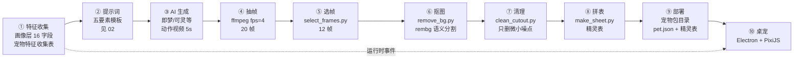

# PetPet Playbook · 桌宠制作方法论

> 不是"又一个桌宠软件"，是**给心爱的宠物做一只活在电脑里的替身**——用 AI 生成它自己的形象、自己的动作、自己的性格，让它在工作时陪着你。

本仓库是一套**完整的方法论**：从宠物特征收集 → AI 素材生成 → 精灵表管线 → 桌宠实现，全程记录真实决策、真实数据、真实踩坑。

> 📦 **仓库内容**：方法论（docs/）+ 素材管线脚本（pipeline/）+ **可运行客户端参考实现**（viewer/，Electron + PixiJS，加载你自己的宠物包即可运行，macOS 实测）。

---


*红苕（一只被做成桌宠的边牧）的 5 个动作演示：睡觉 → 抱熊待机 → 撒娇 → 奔跑 → 伸懒腰。素材由 AI 生成 + rembg 管线制作，全流程见本仓库。*

---

## 快速开始（跑素材管线）

```bash
# 1. 安装依赖
pip install numpy pillow rembg

# 2. 按顺序跑（以 12 帧为例）
python pipeline/select_frames.py --input <抽帧目录> --output selected/ --frames 12
python pipeline/remove_bg.py     --input selected/ --output cutout/
python pipeline/clean_cutout.py  --input cutout/   --output clean/
python pipeline/make_sheet.py    --input clean/    --output . --name mypet.png

# 3. 得到精灵表后，按 08-接口协议 配置 pet.json 部署
```

**验证环境**（可选）：

```bash
python tests/smoke_test.py   # 管线冒烟测试（造数据→选帧→清理→拼表→超限拦截）
```

> 💰 **预算提示**：每个动作的 AI 视频生成约 45-130 积分（即梦平台，2.0/2.5 模型），完整 8 动作是数百积分量级的真实付费成本，动手前先评估。
>
> 🐕 **样本声明**：完整流程目前在单一品种（边牧“红苕”）上验证，换品种/物种时提示词与素材需按 02 重新调优，管线脚本本身通用。

**运行客户端**（viewer/，macOS 实测）：

```bash
cd viewer
npm install          # 安装 Electron + PixiJS（首次约 1-2 分钟）
npm run dev          # 开发模式：加载 ~/.petpet/pets/<宠物名>/ 下的宠物包
npm run build        # 构建渲染层（dist/）
npm start            # 构建后直接启动
```

宠物包结构见 08-接口协议；想用示例宠物，把 examples/redshao/ 整理成宠物包即可。

---

## 快速上手（三条路径）

| 你想做什么 | 看什么 |
|-----------|--------|
| **给自己的宠物做桌宠** | 01（数据模型）→ 02（提示词）→ 05（素材管线）→ 03（需求梳理） |
| **了解完整设计思路** | 00（设计缘起）→ 04（架构）→ 06（参数） |
| **避坑** | 07（踩坑实录）——每条坑都是一条铁律 |
| **定制/扩展** | 08（接口协议）→ 09（双端适配） |

---

## 全景流程（一张图看懂整条链）



- ①②是**一次性**（宠物特征采集 + 设定图核实）；③-⑧是**每动作一次**（素材管线，脚本在 `pipeline/`）；⑨⑩是**增量**（加动作只改数据不改代码）
- 想快速上手：`pipeline/` 四个脚本串起来就是 ④-⑧，每步工具可替换（见 05）

---

## 仓库结构

```
petpet-playbook/
├── README.md            本文档（全景图 + 导航）
├── docs/                方法论文档（00-09，共 10 篇）
├── pipeline/            可运行脚本（抽帧选帧/抠图/清理/拼表）
├── viewer/              客户端参考实现（Electron + PixiJS 源码）
├── tests/               管线冒烟测试
└── examples/redshao/    实例素材（真实照片 + 设定图）
```

---

## 文档导航

```
docs/
├── 00-设计缘起.md     为什么做、交互定稿、脑洞清单（含为什么不做）
├── 01-数据模型.md     16 字段三层模型、比例派生、设定图流程、双端判断
├── 02-特征与提示词.md  五要素提示词模板、红苕实例、失败教训库
├── 03-需求梳理.md     定位演进（桌宠→数字宠物生命）+ 9→8 动作推导、素材演进史
├── 04-架构设计.md     Electron + PixiJS、进程分工、IPC 通道
├── 05-素材管线.md     视频 → 精灵表五步、工具可替换矩阵、质量闸门
├── 06-参数详解.md     每个参数的含义与实验数据
├── 07-踩坑实录.md     9 条真实事故与铁律（黑屏/白毛腿/无热重载…）
├── 08-接口协议.md     pet.json Schema、动作注册表、可定制点
└── 09-双端适配.md     macOS 已实测、Windows 风险点与验证方案
```

---

## 实例素材（examples/redshao/）

红苕（棕白边牧）的完整素材包，演示"从真实照片到设定图"的闭环：

| 文件 | 内容 |
|------|------|
| real-photo-1/2/3.jpg | 真实照片（正面/仰躺/侧躺） |
| setup-image.png | 皮克斯 3D 设定图（主人核实的锚点） |

> 动画素材由 AI 生成（即梦），版权归用户所有；发布时请保留平台 AI 标识要求。

---

## 核心思想（一句话版）

1. **宠物即数据包**：换宠物 = 换目录，不动代码
2. **提示词是特征的翻译**：结构化特征 → 可控生成
3. **每步工具可替换**：即梦/rembg/PIL 都不是唯一解
4. **淘气有边界**：视觉淘气可以，真实文件操作不做
5. **诚实标注状态**：未实测的功能不宣称已支持

---

## 贡献

- 新宠物实例：欢迎提交你的宠物素材包（按 08 接口协议）
- 新踩坑：欢迎在 07 追加你的事故记录
- 脑洞认领：00 的脑洞清单标注了可行性分析，欢迎实现

---

## License

- **代码**（`pipeline/` 脚本等）：[MIT](LICENSE)
- **素材**（`examples/` 中的宠物照片、设定图、演示 GIF）：版权归宠物主人所有，仅作示例展示，请勿商用或二次分发
- **动画素材**由即梦 AI 生成，开源发布时保留 AI 平台标识（详见 02-特征与提示词.md）
