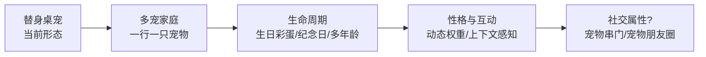

# 00 · 设计缘起：我们到底在做一个什么

> 本文档回答：**做这个宠物的本身目的是什么**，以及一路上想过、试过、放弃的方案。
> 为什么放在 00？因为不先回答"为什么做"，后面所有技术决策都没有锚点。

---

## 1. 目的：不是"做一个桌宠软件"，是"给宠物做一只活的替身"

市面上桌宠软件的功能定位是**工具**（宠物形态的闹钟/备忘录/陪伴机器人）。本项目的出发点完全不同：

> **给主人心爱的真实宠物（狗/猫）做一只活在电脑里的替身**——用 AI 生成它自己的形象、自己的动作、自己的性格，让它在工作时陪着你。

这决定了三个根本差异：

| 维度 | 通用桌宠 | 本项目的替身桌宠 |
|------|---------|-----------------|
| 形象来源 | 预设角色（二次元/动物） | **真实宠物的 AI 生成形象**（皮克斯3D化） |
| 特征 | 通用卖萌 | **每只宠物的独有特征**（围脖没开完、嘴筒子麻子） |
| 数据 | 用户无感 | **宠物档案**（特征收集表：生日/体型/花色/性格） |
| 生命周期 | 一次性 | 生日彩蛋、纪念日、多年龄版本 |

**一句话：别人做宠物形态的软件，我们做真实宠物的数字化生命。**

### 1.1 为什么不是"上传照片一键生成"？

最初的设想确实是"照片/视频就能生成"——一键、傻瓜式。做完第一只宠物后这条路被否决，三个硬事实：

1. **AI 生成是抽卡**：同一条提示词 8 次生成可能只有 1 次合格。一键工具等于把抽卡成本转嫁给用户，失败体验会杀死产品。
2. **主人核实不可替代**：AI 生成的设定图会被 AI 自己认错品种（真实案例：金毛×德牧混血被误判成迷你宾莎）。只有主人能拍板"这就是我的狗"。
3. **性格要人来喂**：特征收集表是主人对宠物的理解，AI 无法替主人回答"它撒娇是什么样"。

所以最终形态是**半自动管线**：机器做重复劳动（抽帧/抠图/拼表），人做判断（特征/提示词/选帧/核实）。**嫌麻烦就用豆包，要性格就按这套走**——这是"麻烦"与"生命感"的交换，两条路没有优劣之分。

---

## 2. 产品愿景（上限在哪）

当前已到 B/C 的起点（多宠数据模型已设计、生日彩蛋已定稿挂起）；D 是下一个技术升级（动态权重系统，见 01-数据模型.md §6.2）；E 是开放问题（见 §4 脑洞）。

---

## 3. 交互设计（定稿）

历经多轮方案推演，最终定稿如下：

| 交互 | 定稿 | 放弃的方案 |
|------|------|-------------|
| 单击 | 互动气泡（「汪！」「摸摸我～」） | ~~单击=功能面板~~（太重） |
| 双击 | 重置大小 | — |
| 右键 | 原生菜单（提醒/日记/8动作/重置大小） | ~~HTML 自定义菜单~~（Electron 透明窗口装不下+不毛玻璃） |
| 托盘 | 功能主入口（红苕头像） | — |
| 长按 | — | ~~长按=菜单~~（与右键重复） |

功能定稿：**提醒系统**（自然语言时间解析，到点粉色常显条+wiggle 动作）+ **红苕日记**（动作同步心情记录，100 条滚动）+ **三主题换肤**（bro/sis/orange；换肤入口因 UI 重构暂时隐藏）+ **8 动作**（idle/sleep/sniff/wiggle/run/belly/poop/stretch）。

---

## 4. 脑洞清单（设计探索 · 未实现）

> 这些是我们认真想过、但**尚未实现**的设想。标注了可行性与"为什么不做/暂缓"——供后来者参考或认领。

### 4.1 桌面窗口嵌入式交互（暂缓）
- **设想**：宠物能感知桌面窗口布局，钻进窗口角落、趴在窗口边缘
- **可行性**：中。需要窗口管理 API（macOS Accessibility），权限敏感
- **为什么暂缓**：权限边界 + 与"绝不打扰"理念冲突

### 4.2 应用感知（暂缓）
- **设想**：微信旁边漏出个狗头，你在刷什么它就在旁边陪
- **可行性**：中。检测前台应用即可
- **为什么暂缓**：前置 4.1 的窗口感知能力

### 4.3 开会时敲你界面让你陪它玩（放弃）
- **设想**：会议中宠物敲打你的软件界面求陪玩
- **为什么放弃**：与核心体验矛盾——桌宠是**陪伴**不是**打扰**。「绝不打扰」是红线（详见 4.5）

### 4.4 叼走回收站就跑（安全红线 · 明确不做）
- **设想**：宠物真的去叼走一个回收站图标就跑（文件行为）
- **为什么不做**：**真实文件操作有风险**（同类设计审查中判「高风险行为」剔除）。桌宠的"破坏性"停留在视觉层面（拉粑粑、跑动），**永不触碰真实文件系统**——这是价值观红线，也是安全底线
- 附带教训：桌宠的淘气要有边界，视觉淘气 ≠ 系统级淘气

### 4.5 绝不打扰模式（尝试后放弃）
- **设想**：检测会议/专注状态，自动缩小静默
- **演进**：自动检测会议应用 → 被否（误判风险）→ 托盘手动开关版 → 被砍（做减法，必要性不强）
- **结论**：桌宠本体保持"被动响应"哲学——**不主动打扰，除非用户主动交互**。这本身就是最好的"绝不打扰"

### 4.6 生日系统与社交属性（部分定稿 · 开放问题）
- **定稿部分**：生日彩蛋——主人/狗狗/狗狗朋友的生日，触发温和气泡+对应动作（wiggle/belly/run），记入日记。已定稿挂起（等数据齐：红苕生日 2023-08-20 已录）
- **开放问题**：**是否真正加入社交属性**？
  - 设想：今天是狗狗朋友的生日，红苕扭着大屁股说「我去玩了」，跳到朋友家去串门
  - 可行性：中高（数据模型已支持：好友关系字段）
  - 代价：社交 = 联网 = 隐私/账户/审核成本。桌宠的"单机陪伴"属性会变质
  - 结论：**默认不做，作为未来开放讨论**。单机纯陪伴是当下最安全的定位

---

## 5. 为什么这些脑洞值得写进文档

1. **贡献入口**：每个脑洞标注了可行性分析和被砍原因，后来者可以直接认领实现
2. **决策透明**：读者看到"为什么不做"（安全红线/体验矛盾/成本），比只看到"做了什么"更有价值
3. **价值观展示**：叼回收站这类脑洞的否决，展示这个项目的边界意识——**淘气有边界**

---

## 6. 本文档可自行修改的点

1. 脑洞清单可以增删——每个新脑洞按 §4 格式（设想/可行性/为什么做或不做）
2. 交互设计是**已定稿**的，改动需重新评估
3. 社交属性是开放问题，欢迎不同意见
