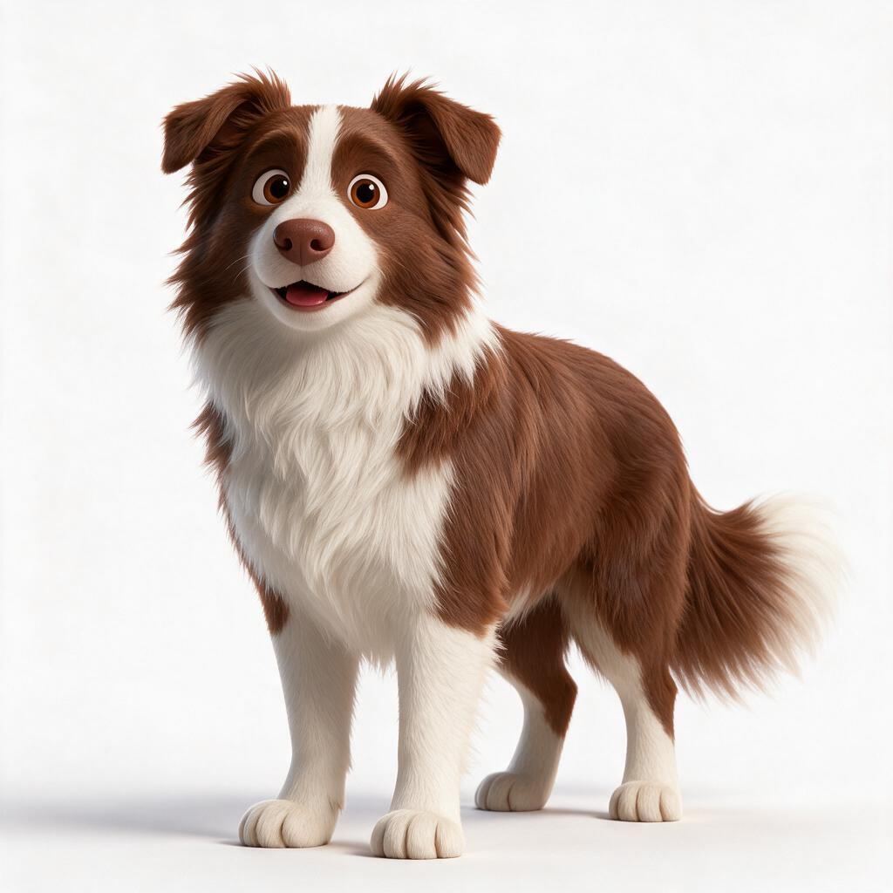

# 01 · 数据模型：从一只狗到一张表

> 本文档回答三个问题：**数据从哪来、怎么流、流到哪**。
> 整个项目不是从"写代码"开始的，而是从一张**宠物特征收集表**开始的——每个字段都是数据库的底层基座。

---

## 1. 为什么先设计数据模型

先定数据模型，再定功能。这是本项目的第一性原则：

- **字段决定功能边界**：一个字段没有被设计出来，对应功能就不可能存在（比如没有"生日"字段，就不会有生日彩蛋）
- **字段决定生成质量**：提示词不是玄学，是特征的翻译——特征收集得越结构化，生成越可控
- **字段决定扩展空间**：单宠→多宠、单年龄→多年龄，都取决于字段设计时有没有留口

---

## 2. 三层数据模型总览


| 层 | 载体 | 生命周期 | 消费方 |
|----|------|---------|--------|
| 画像层 | 特征收集表（Excel/表格） | 每只宠物创建时采集一次 | 人（主人填）+ AI（机器判断） |
| 生成层 | 提示词模板 | 每次生成素材时消费 | AI 视频生成工具（即梦等） |
| 运行时层 | pet.json + 精灵表 | 桌宠运行时持续读取 | 桌宠客户端（PetPet） |

关键设计：**画像层与运行时层解耦**。生物特征（体长、花色）只存在于画像层，生成时消费完即完成使命；运行时只需要"动画怎么播"的配置。所以 pet.json 里**没有**体长腿长——那不是运行时需要的。

---

## 3. 画像层：宠物特征收集表（16 字段）

### 3.1 设计原则

1. **可量化 vs 不可量化分离**：测量值（体长/体高/腿长/体宽 cm）→ 机器可计算的派生字段（比例）；不可量化细节（花色、麻子、围脖没开完）→ 自由文本
2. **每个字段必须有下游**：要么直接进提示词，要么派生后进提示词，要么驱动运行时事件（生日→彩蛋）——没有下游的字段不设计
3. **主人负担最小化**：能自动算的（比例）不让人填，能一句话说清的不让人写段落

### 3.2 字段全表

#### A. 身份类（7 字段）

| 字段 | 含义 | 为什么需要 | 下游逻辑 | 扩展性 |
|------|------|-----------|---------|--------|
| 主人昵称 | 宠物归属 | 一主多宠场景分组（实测：一七家 5 只共用一行主人） | 数据归属、多主人项目协作 | 多家庭/多主人权限 |
| 宠物名字 | 唯一标识 | 目录名 `pets/<名字>/`、桌宠显示名 | 运行时身份 | 重名冲突策略 |
| 品种 | 品种基线 | 决定体型先验（边牧 vs 柯基 vs 阿拉斯加差异巨大） | 提示词品种锚点「皮克斯3D卡通风格的棕白边牧」 | 品种特征库 |
| 性别 | 公/母 | UI 主题默认值 + 文案人称（公狗→弟弟款主题，实测结论） | 主题默认（theme）、日记/气泡人称 | 更多性别表达 |
| 生日/到家时间 | 双日期 | 生日→彩蛋系统；到家时间→纪念日（两件事分开记） | 运行时事件触发 | 多纪念日扩展 |
| 希望出几岁模型 | 年龄态 | 幼年/成年/老年体态特征不同 | 生成形象年龄定义 | **多年龄版本预留**（见 §6.1） |
| 客户端设备 | Windows/Mac/双端 | 打包目标 + UI 适配范围 | 生产决策（实测：叮当主人填「两个都要！」） | 移动端？ |

#### B. 体型类（7 字段）

| 字段 | 含义 | 为什么需要 | 下游逻辑 | 扩展性 |
|------|------|-----------|---------|--------|
| 体长 cm | 原始测量 | 输入层 | 派生→长宽高比例 | — |
| 体高 cm | 原始测量（比例基准=1） | 输入层 | 派生→长宽高比例、腿长比 | — |
| 腿长 cm | 原始测量 | 输入层 | 派生→腿长比 | — |
| 体宽 cm | 原始测量 | 输入层 | 派生→长宽高比例 | — |
| 体型（细长/标准/粗壮/胖墩） | 离散分类 | 比测量值更直观的体型锚点（胖墩 vs 细长生成差异最大） | 提示词体型锚点 | 更多体型粒度 |
| 长宽高比例（**自动**） | 派生：体长:体宽:体高（体高=1） | **对动画化模型的生成进行比例限制** | 提示词比例描述（红苕 1.2:0.4:1） | — |
| 腿长比（**自动**） | 派生：腿长:体高 | 腿长是品种辨识度最高特征（柯基 0.4 vs 边牧 0.6-0.7） | 提示词腿长描述 | — |

#### C. 外观类（2 字段）

| 字段 | 含义 | 为什么需要 | 下游逻辑 | 扩展性 |
|------|------|-----------|---------|--------|
| 补充说明 | 自由文本：花色/特征/照片拍不清的细节 | 不可量化细节的唯一载体 | 直接进提示词（红苕：「咖白花色，右侧围脖没开完，嘴筒子有几个麻子」） | 结构化标签化 |
| 照片 | 正面清晰照 + 其他角度 | 特征提炼的视觉依据 | AI 机器判断（见 §3.5） | 多角度/视频 |

### 3.3 派生字段计算逻辑

```
长宽高比例 = 体长 : 体宽 : 体高   （体高归一化为 1）
腿长比     = 腿长 / 体高
```

实例（红苕）：体长 60、体高 50、腿长 30、体宽 22 → 长宽高比例 **1.2:0.4:1**，腿长比 **0.6:1**。

设计意图：**比例是生成的质量闸门**。AI 视频生成对"绝对尺寸"无感，对"相对比例"敏感——不给比例限制，同一句提示词可能生成 1:1 的胖狗或 3:1 的腊肠。比例字段把主人的测量转化为机器的约束。

### 3.4 为什么是皮克斯 3D 风格（关键决策链）

这是全项目最重要的一条决策记录——**为什么放弃真实动物、选择 AI 生成皮克斯 3D 风格**：

```
原方案：现实视频抽帧 → 真实动物动画
  ↓ 尝试后发现
瓶颈：真实动物逐帧动画必须搭建 3D 骨架（骨骼绑定/蒙皮）才能实现
  ↓
链条过长：现实视频 → 抽帧 → 逐帧描摹 → 3D 骨架 → 蒙皮 → 动画
资源门槛：需要三维建模能力 + 绑定师 + 动画师，个人项目不可及
  ↓ 决策
转 AI 视频生成（即梦等） + 皮克斯 3D 卡通风格化
```

选择皮克斯 3D 风格的具体收益：

1. **规避真实动物版权与肖像问题**（真实狗视频素材不可随意分发）
2. **风格统一可控**：同一提示词模板 + 同一参考图，多只宠物风格一致
3. **AI 生成可控性最好**：皮克斯 3D 是文生视频模型训练最充分的风格域之一
4. **比例约束可精确传达**：风格化允许夸张比例（短腿柯基更短、胖墩更圆），与比例字段天然配合

### 3.5 特征提炼：人机互补流程

特征不是"扫描"出来的，是**人机协作**的：

```
主人写描述（提示词初稿）
    ↕ 互补
AI 看照片做机器判断（图像 → 特征提炼）
```

| 输入 | 用途 | 谁主导 |
|------|------|--------|
| 正面清晰照 | 主人最在意的**五官**真实特征提炼 | AI 机器判断为主 |
| 其他角度照片 | 宠物**独有/特有动作特征**观察（坐姿、歪头、尾巴形态） | AI 机器判断为主 |
| 主人的文字描述 | 对 AI 判断的补充（照片拍不清的细节、性格、习惯） | 主人 |

原则：**AI 先看，主人补充**。AI 的机器判断是基线，主人的描述是修正项——避免只靠一方（AI 会漏细节，主人会漏客观特征）。

### 3.6 设定图：从真实照片到主人核实的锚点

设定图是**主人亲自核实敲定的正面图**——全流程的信任锚点：AI 生成的一切动作素材都基于它。

```
真实照片（主人拍摄）──► AI 生成候选设定图 ──► 主人亲自核实 ──► 敲定为锚点
```

红苕实例（`examples/redshao/` 目录）：

| 文件 | 内容 | 角色 |
|------|------|------|
| real-photo-1.jpg | 真实照片·户外正面站立 | 特征提炼的视觉基线（正面清晰照） |
| real-photo-2.jpg | 真实照片·仰躺 | 其他角度（动作特征观察） |
| real-photo-3.jpg | 真实照片·侧躺 | 其他角度（动作特征观察） |
| setup-image.png | 皮克斯3D设定图（主人核实敲定） | **生成锚点**（@图片1） |




**第二样本：包包（金毛×德牧混血）**（`examples/baobao/` 目录）——验证品种可迁移性：

| 文件 | 内容 | 角色 |
|------|------|------|
| real-photo-face.jpg | 真实照片·半身正面（纯色背景） | 面部/五官特征提炼 |
| real-photo-full.jpg | 真实照片·全身卧姿（无遮挡） | 全身结构特征提炼 |
| real-photo-full2.jpg | 真实照片·正面端坐（披毯） | 备用全身照 |
| setup-image.png | 3D设定图（主人核实敲定） | **生成锚点**（@图片1） |

> 💡 **「主人核实」为什么不可替代**：对包包设定图做 AI 视觉识别时，模型曾把它误判为「迷你宾莎/曼彻斯特梗」——实际是金毛×德牧混血。**AI 生成的候选图连 AI 自己都认不准品种**，只有主人能确认「这像不像我家狗」。这就是为什么核实必须是人工环节。

**流程要点**：

1. 真实照片是**特征提炼的基线**——主人拍摄，记录真实毛色/五官/比例
2. 候选设定图由 AI 生成（即梦/其他 AI 生图工具），可以多轮迭代
3. **主人亲自核实是必经环节**——只有主人能判断「这像不像我家狗」。敲定后的设定图成为所有后续生成的形象锚点
4. 设定图风格决定生成风格：皮克斯3D设定图 → 皮克斯3D生成

### 3.7 标识符设计：为什么生日不能直接做 UID

初版方案曾设想「UID = 生日」，被否——标识符有两条铁律，生日两条都不满足：

| 铁律 | 生日的问题 |
|------|-----------|
| ① 全局唯一 | 多宠家庭两只宠物可能同生日；朋友间互换宠物包也可能撞生日 |
| ② 不可变 | 很多宠物是领养的，生日是估计的——哪天更正生日 = UID 变了 = 所有引用（目录名、存档、关联数据）全部断裂 |

**设计：三层字段，职责分离**（当前运行时 pet.json 仅用到 `id`；`uid` 为跨包交换/多宠家庭预留，尚未进入 08 契约与代码）

| 字段 | 内容 | 职责 | 可否变更 |
|------|------|------|---------|
| `id` | 拼音名/目录名（redshao） | 运行时身份：目录、pet.json、显示名 | 永不变 |
| `uid` | 生日+序号（20230820-01） | 跨包稳定唯一标识：存档、交换、多宠家庭防碰撞 | 永不变 |
| `birthday` / `gotchaDay` | 真实日期 | 事件驱动：生日彩蛋、纪念日 | **可更正**（更正不影响 id/uid） |

实例（红苕）：`id=redshao`、`uid=20230820-01`、`birthday=2023-08-20`。

**设计要点**：

1. **引用用 id/uid，事件用 birthday**——引用链路永不因数据更正而断
2. uid 的序号位（-01）解决同日多宠；跨家庭交换时前缀可加主人标识
3. 更正生日是**常态**（领养犬、记错日子），所以生日必须与标识完全解耦

---

## 4. 生成层：特征 → 提示词

详细模板见 `02-特征与提示词.md`。此处只说明数据流：

```
画像层字段 ──翻译──► 提示词模板 ──消费──► AI 视频生成工具（即梦/可灵/其他）
  │                     │
  │                     └──► 工具可替换（见 05-素材管线.md 工具矩阵）
  └── 比例/体型/品种/补充说明/照片 ──► 全部进提示词
```

提示词模板骨架（以红苕为例）：

```
保持 @图片1 这只皮克斯3D卡通风格的棕白边牧形象不变，全身完整入镜，包含尾巴。
[体型]：粗壮体型，体长体高比约 1.2:1，腿长比例约 0.6:1
[特征]：咖白花色，右侧围脖没开完，嘴筒子有几个麻子
[动作]：<动作描述>
```

---

## 5. 运行时层：pet.json（详见 [08-接口协议.md](08-接口协议.md)）

当前实现字段（8 动作定稿后）：

| 字段 | 含义 | 备注 |
|------|------|------|
| id / name | 宠物标识 | 目录名 |
| theme | 主题皮肤 | bro/sis/orange |
| actions | 动作配置表 | 每个动作含下方字段 |
| file | 精灵表文件路径 | 相对宠物目录 |
| frames | 帧数 | 精灵表横向切片数 |
| fps | 播放帧率 | 默认 4（代码 `act.fps \|\| 4`）；红苕实测收敛值为 5（决策链见 [06-参数详解](docs/06-参数详解.md) §3） |
| weight | 随机权重 | 静态权重（未来升级见 §6.2） |
| pingpong | 往返播放 | 循环动画平滑 |
| frameWidth / frameHeight | 单帧尺寸 | 精灵表切片 |
| scale | 显示缩放 | 窗口适配 |
| loop | 循环 | — |

**画像层 ↔ 运行时层的边界**：生物特征在生成时消费，不进运行时。但**权重**是桥梁——画像层的"性格/互动习惯"未来会映射为动态权重（§6.2）。

---

## 6. 预留字段与未来设计

### 6.1 多年龄版本（确认预留）

- 现状：主人给的原图本身定义了年龄（豆豆要"2岁"版就出 2 岁版）
- 预留：同一宠物多年龄版本（幼年/成年/老年），字段设计预留 `ageVersions` 结构
- 设计原则：**先有数据再拆版本**——每版年龄 = 一组提示词 + 一组素材 + 一组 pet.json

### 6.2 动态权重系统（未来升级方向）

- 现状：`weight` 是静态随机权重（动作随机播放的概率）
- 升级：**上下文感知权重**——同一动作在不同互动场景下权重不同：
  - 点击互动权重：被点击后，撒娇/奔跑权重升高
  - 文字互动权重：对话后，回应性动作权重升高
- 数据模型影响：weight 从单值 → `{default, onClick, onTalk, ...}` 结构

### 6.3 多宠家庭与自定义动作

- 单宠 → 多宠 = **加行**（一行一只宠物），数据模型天然支持
- 动作列表按使用者需求添加（自定义动作）：8 个标准动作（idle/sleep/sniff/wiggle/run/belly/poop/stretch）是基线，不是上限
- 影响：动作名注册表 + 精灵表规范要开放（见 [08-接口协议.md](08-接口协议.md)）

### 6.4 社交属性（脑洞，见 [00-设计缘起.md](00-设计缘起.md)）

生日系统（主人/狗狗/狗狗朋友的生日）、生日串门等——全部依赖画像层的"生日/关系"字段扩展。

---

## 7. 双端适配判断（作者观点，非实测结论）

**技术判断：双端可实现。** 依据：

- Electron 跨平台方案成熟，主代码一次编写
- 代码层已具备跨平台条件：路径全用 path.join、用户数据走 `~/.petpet`（Windows 自动映射）、CSS 含微软雅黑字体 fallback

**未验证项（诚实标注）**：

| 风险点 | 性质 | 处理 |
|--------|------|------|
| Windows 透明窗口不支持 backdrop-filter 毛玻璃 | 视觉降级，非功能缺失 | 双端 UI 需降级适配 |
| ~~electron-builder 未配置 win 打包目标~~ | 配置缺失 | ✅ 已解决（2026-08-08，CI Windows job 已出包，见 09-双端适配） |
| ~~build.files 漏 panel 文件~~ | 配置缺失 | ✅ 已解决（2026-08-08，已补 `panel/**` 进 build.files） |

**结论**：截至编写时仅在 macOS 实测，Windows 端尚未验证；代码层跨平台条件已具备，剩余为配置与视觉适配工作。作者判断可实现，但**未经实测前不对外宣称"已支持 Windows"**——诚实标注状态。

---

## 8. 本文档可自行修改的点（授人以渔）

拿到这套数据模型的人可以按需调整：

1. **加字段**：按自己的宠物类型（猫、鸟、爬宠）增补特征字段——记住"每个字段必须有下游"
2. **改比例基准**：体高=1 的归一化可以换成任意基准
3. **换风格**：皮克斯 3D 是已验证路径，换写实/2D 风格需重调提示词模板（见 [02-特征与提示词](docs/02-特征与提示词.md) 风格迁移注意点）
4. **扩动作**：8 个标准动作之外自定义动作，按 08 接口协议扩展
