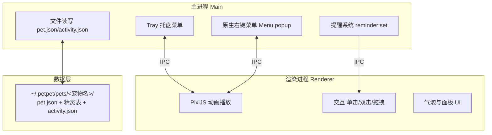

# 04 · 架构设计：Electron + PixiJS 的桌宠骨架

> 本文档回答：桌宠程序由哪些部分组成、数据怎么流、为什么这么分。
> 核心结论：**主进程管系统、渲染进程管画面、数据层管宠物**——三者解耦是后续所有功能扩展的地基。

---

## 1. 技术选型

| 层 | 技术 | 选型理由 |
|----|------|---------|
| 桌面容器 | Electron | 跨平台（macOS/Windows）、透明窗口、托盘、系统菜单原生支持 |
| 渲染引擎 | PixiJS | WebGL 精灵表动画、轻量（相对 Three.js）、2D 精灵动画最优解 |
| 数据 | JSON（pet.json + 精灵表 PNG） | 宠物即数据包，换宠物=换目录，不动代码 |

对比过 Tauri（WindowPet/wimipet 用）：更轻但生态较新，Electron 的透明窗口+托盘+原生菜单成熟度更高。本项目动画复杂度低，Electron 的体积劣势可接受。

---

## 2. 进程架构



| 进程 | 职责 | 关键点 |
|------|------|--------|
| 主进程 | 托盘、原生菜单、提醒调度、文件读写 | 系统级能力都在这里（macOS 菜单栏/Dock 图标） |
| 渲染进程 | 精灵表动画、交互、UI | PixiJS 播放，窗口透明 |
| preload | IPC 桥 | 上下文隔离，暴露 `petAPI` |

**为什么原生菜单走主进程**：Electron 透明窗口里 CSS 菜单装不下 12 项且做不出真毛玻璃——系统级 `Menu.popup` 自动定位、自动毛玻璃、不裁切（踩坑记录见 07）。

---

## 3. 窗口设计

| 属性 | 值 | 说明 |
|------|-----|------|
| 尺寸 | 320×320 | 固定基准（WINDOW_W/H） |
| 透明 | 是 | 精灵表透明区域透出桌面 |
| 无边框 | 是 | 宠物本体即窗口 |
| 置顶 | 是 | 悬浮于工作区 |
| 鼠标穿透 | 动态切换 | 平时穿透（不挡工作），悬停/交互时解除 |

**适配逻辑**：`fit = min(窗口宽/帧宽, 窗口高/帧高)`——横版帧（1024×576）在正方形窗口里上下留白，竖版帧等比缩放。

---

## 4. IPC 通道表（主进程 ⇄ 渲染进程）

| 通道 | 方向 | 用途 |
|------|------|------|
| `pet:loaded` | 主→渲染 | 宠物数据加载完成 |
| `reminder:set` | 渲染→主 | 设置提醒（自然语言时间解析） |
| `reminder:fire` | 主→渲染 | 提醒到点触发 |
| `contextmenu` | 渲染→主 | 请求弹出原生右键菜单 |
| `notifyAction` | 渲染→主 | 动作切换通知（日记状态同步） |

---

## 5. 数据流：从宠物包到屏幕

```
启动
 ├─ 主进程读 ~/.petpet/pets/<宠物名>/pet.json
 ├─ 渲染进程按 pet.json 加载精灵表 PNG
 ├─ 按 act.frameWidth/frameHeight 水平切片（new PIXI.Rectangle）
 ├─ AnimatedSprite 按 fps 播放
 └─ 动作切换 → appendActivity 写 activity.json → 日记面板实时同步
```

**关键设计**：宠物包（pet.json + 精灵表 + activity.json）是**纯数据**，与代码完全分离——换宠物、加动作、调参数全部改数据不改代码。

---

## 6. 扩展点（架构预留）

| 扩展 | 落点 | 状态 |
|------|------|------|
| 多宠家庭 | 数据层加目录 | 数据模型已支持（见 01） |
| 动态权重 | pet.json weight 结构扩展 | 设计预留（见 01 §6.2） |
| 生日彩蛋 | 主进程定时检测 birthdays.json | 设计定稿挂起 |
| 自动重载 | 主进程 fs.watch 精灵表 | 待评估（当前改资源需重启） |

---

## 7. 本文档可自行修改的点

1. **换容器**：Tauri/原生皆可，但透明窗口+托盘+原生菜单三件套是底线能力
2. **换渲染**：非 PixiJS 的 2D 引擎也可，精灵表切片逻辑通用
3. **改窗口尺寸**：WINDOW_W/H 是全局常量，适配逻辑自动跟随
