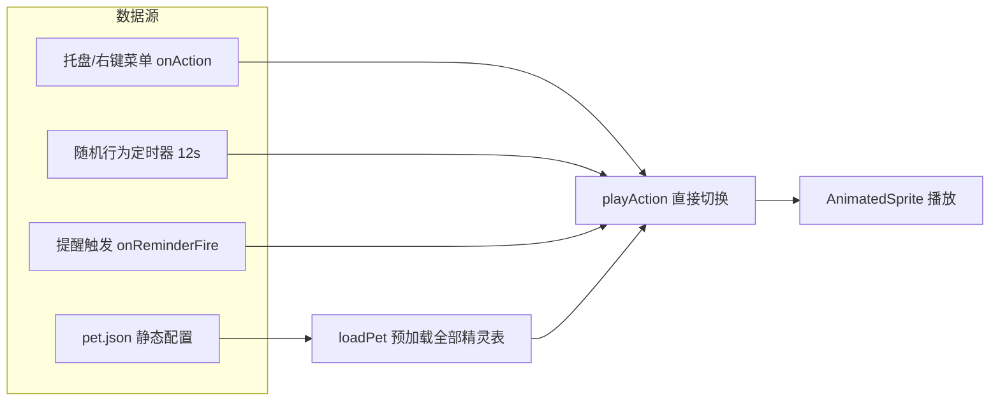

# 10 · 运行时架构升级评估：从 Clawd-on-desk 借鉴什么

> 本文是架构评估，不是既定方案。结论分「立即做 / 值得做 / 不做」，每项标注改动锚点（文件/函数）、成本、风险、验证方式。
> 评估对象：Clawd-on-desk（GitHub: rullerzhou-afk/clawd-on-desk，2026-08 快照，约 5.8k star）的中间逻辑层，与本仓库 viewer/ 客户端参考实现对比。

## 1. 为什么评估

外部多轮评估（产品视角、全文逐字视角、代码级视角）独立命中了同一个信号：**本仓库的素材生产管线（docs/05 + pipeline/）是完整闭环，但运行时客户端（viewer/）的架构深度与管线不匹配**——管线有实验数据、有铁律、有测试，而 viewer 的动作切换仍是"函数直调 + 随机权重"，没有事件抽象、没有状态仲裁、没有主题包机制。

Clawd-on-desk 是同类 Electron 桌宠中架构最完整的开源实现，其**中间逻辑层**（状态仲裁、适配器网关、主题包系统）恰好覆盖了 viewer 的缺口。本文评估：哪些值得吸收、怎么吸收、吸收到什么程度。

## 2. viewer 现状（数据流与缺口）

### 2.1 当前数据流



### 2.2 关键事实（对照源码）

| 项 | viewer 现状 | 代码位置 |
|---|---|---|
| 动作切换入口 | `playAction(name)` 函数直调，无统一仲裁 | `src/main.ts` |
| 触发源 | 菜单/随机/提醒 三处直接调用，无事件概念 | `onAction`、`startRandomBehavior`、`handleReminderFire` |
| 状态优先级 | 无。随机行为有 `currentAction !== 'idle'` 守卫，但提醒 `playAction('wiggle')` 可打断任何动作 | `startRandomBehavior` |
| 一次性 vs 循环 | 无一次性概念。播放完回 idle 靠 `setTimeout(4000)` 硬编码 | `startRandomBehavior` 内 |
| 睡眠序列 | 无。sleep 是单一动作，无 yawning→dozing→collapsing→sleeping→waking 迁移 | — |
| 主题 | 三套 CSS 变量（bro/sis/orange）硬编码在 `panel.css` + `document.body.dataset.theme` | `panel.css`、`main.ts` |
| 宠物包互操作 | 无（docs/08 §4 只写了 Codex Pet 规格，未实现导入器） | docs/08 |

### 2.3 缺口的本质

viewer 的动作系统是**"随机播放器"**（weight 权重 + 定时器），不是**"状态机"**。产品化（喂食、心情、多宠、外部联动、换装）需要的是后者：事件进来 → 仲裁谁优先 → 驱动状态迁移 → 渲染。这个中间层，Clawd 有，viewer 没有。

## 3. Clawd 中间层解剖（可借鉴的三件套）

### 3.1 状态优先级仲裁 — `src/state-priority.js`

```js
const STATE_PRIORITY = Object.freeze({
  error: 8, notification: 7, sweeping: 6, attention: 5,
  carrying: 4, juggling: 4, working: 3, thinking: 2,
  idle: 1, roam: 1, sleeping: 0,
})
const ONESHOT_STATE_NAMES = ["attention", "error", "sweeping", "notification", "carrying"]
const SLEEP_SEQUENCE_STATES = ["yawning", "dozing", "collapsing", "sleeping", "waking"]
```

设计要点（这是可借鉴的核心，不是那张表本身）：
- **优先级表**：多个事件同时到达时，数字大的赢。error(8) 永远打断 idle(1)。
- **一次性状态**（ONESHOT）：播完自动回基线，不需要调用方记得"播完回 idle"——`setTimeout(4000)` 硬编码的替代品。
- **睡眠序列**：进入/退出睡眠是状态迁移链，不是单点切换。

### 3.2 适配器网关 — `src/agent-gate.js` + `agents/`（30+ 适配器）

- 每个外部数据源一个适配器文件，统一输出标准事件。
- `agent-gate.js` 是**纯函数 gate**：基于快照判断某个源是否启用，无副作用、可单测。
- 意义：数据源可插拔。viewer 对应的抽象是"触发源"（菜单/随机/提醒/未来任何东西）→ 统一事件。

### 3.3 主题包系统 — `src/theme-loader.js` + `theme-schema.js`

- 主题 = 数据包：schema 校验（`REQUIRED_STATES` 必填状态）、能力探测（`buildCapabilities`）、fallback 机制、外部素材目录解析。
- 配套 `codex-pet-importer.js`：导入 Codex Pet 格式宠物包（docs/08 §4 写的规格，它已实现导入器）。

### 3.4 明确不借鉴的部分（领域逻辑）

以下属于 Clawd 的领域（AI 编程助手监控），与宠物桌宠无关，吸收时**整体排除**：
- `agents/` 30+ 个 AI 工具适配器（Claude Code/Codex/Cursor…）——不是"可插拔"就能搬，领域语义完全不同
- 权限审批（permission-*.js）、远程审批（telegram/feishu/remote-ssh）——依赖它的 Agent 会话体系
- session 管理、quota-ring、doctor 诊断——均为 Agent 监控专用

## 4. 落地评估（三项升级，分优先级）

### P0 · 状态仲裁层（立即做，成本低，收益最高）

**目标**：动作切换从"函数直调"变为"请求仲裁"。

**改动锚点**（全部在 `viewer/src/`）：
1. 新增 `state-priority.ts`（约 60 行）：
   - 优先级表：`{ sleep: 0, idle: 1, sniff: 2, run: 3, belly: 3, wiggle: 4, stretch: 4, poop: 5, remind: 7 }`（数值按"打断价值"排，提醒 > 拉粑粑 > 撒娇 > 奔跑 > 嗅闻 > 待机 > 睡觉）
   - ONESHOT 集合：`wiggle`、`stretch`、`poop`（播完自动回 idle，替代 setTimeout 硬编码）
   - `requestAction(name)` 统一入口：低优先级请求在播放中时被拒绝或排队
2. 改造 `main.ts` 三处触发源 → 全部走 `requestAction()`：
   - `onAction`/`onTestAction`（菜单）→ 最高权限，直接执行
   - `startRandomBehavior`（随机）→ 仅 idle 且无高优先级动作时触发
   - `handleReminderFire`（提醒）→ 以 remind(7) 优先，可打断一切（当前行为，固化为规则而非巧合）
3. 删除 `startRandomBehavior` 内的 `setTimeout(() => playAction(backTo), 4000)`，改由 ONESHOT 机制回 idle。

**成本**：约 1 小时编码 + 1 小时回归（8 动作逐个验证 + 提醒打断测试）。
**风险**：低。纯增量，不破坏现有功能；行为变化仅一处——"播放中再触发低优先级"从"直接覆盖"变为"忽略"。
**验证**：新增 `tests/test_state_priority.ts`（纯函数单测：优先级比较、ONESHOT 判定、请求仲裁），进现有 CI。

### P1 · 触发源事件层（值得做，产品化前置）

**目标**：触发源抽象为可插拔事件源，为多宠/外部联动铺路。

**改动锚点**：
1. 新增 `events.ts`：定义事件协议 `{ type: 'menu' | 'random' | 'reminder' | 'click' | 'external', action: string, priority: number }`
2. 现有三处触发源各包一层 adapter（约 40 行/个），`requestAction` 只认事件不认调用方
3. 预留 `external` 类型：未来天气/日程/传感器接入不需要改核心逻辑

**收益**：多宠切换（每个宠物独立事件源）、外部联动（如"日程冲突时红苕趴着不动"）、第三方插件。
**成本**：约 2 小时。
**风险**：中。需要先定事件协议（一旦定了，后续接入方都按协议来，协议错了返工）。
**验证**：事件协议单测 + 现有功能回归。

### P2 · 主题包 schema（缓做，生态成熟后再做）

**目标**：三主题 CSS 变量升级为可加载/可校验的主题数据包。

**改动锚点**：
1. 新增 `theme-schema.ts`（参考 Clawd `REQUIRED_STATES`/`validateTheme`）：定义主题包结构 + 必填校验 + fallback
2. `panel.css` 三主题变量抽成独立主题文件，`theme-loader` 运行时加载
3. 可选：实现 `codex-pet-importer`（docs/08 §4 规格落地）

**收益**：第三方主题、素材包互操作（Codex Pet 格式）、换装市场。
**成本**：约 4-6 小时，且涉及 panel.css 重构（影响面大）。
**风险**：高。CSS 变量体系改动影响全部面板样式；主题包格式一旦发布就是兼容性承诺。
**建议**：**先不做**。等 P0/P1 落地、生态有真实互操作需求（有人真的在做第三方宠物包）再启动，避免为想象中的需求买单。

## 5. 结论

| 项 | 结论 | 理由 |
|---|---|---|
| P0 状态仲裁层 | **立即做** | 成本 1 小时，解决"动作系统不是状态机"的根本问题，替代 setTimeout 硬编码 |
| P1 触发源事件层 | **值得做** | 产品化前置，协议先定、成本可控 |
| P2 主题包 schema | **缓做** | 影响面大、暂无真实需求，避免过度设计 |
| Clawd 领域逻辑（Agent 监控/审批/远程） | **不借鉴** | 领域语义不同，吸收即负债 |
| 借壳（改 Clawd 源码做宠物桌宠） | **不做** | 领域逻辑剥除成本高，viewer 已是等价壳 |

**一句话**：借鉴的是 Clawd 的**中间层设计模式**（优先级表、一次性状态、事件可插拔），不是它的**代码**，更不是它的**壳**。落点全部在我们自己的 viewer 内，素材管线（本仓库护城河）不受影响。
